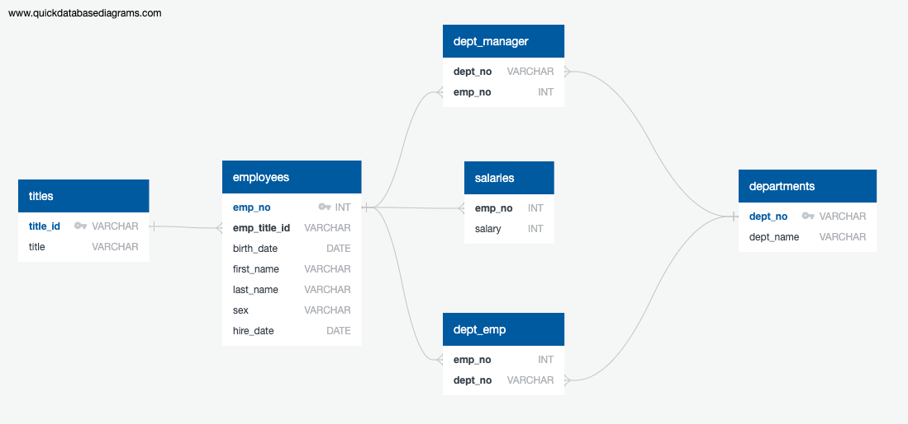

# Employee Database-SQL: A Mystery in Two Parts


## Background

This repository discusses a research project on the employee database at  Pewlett Hackard Corporation from the 1980s and 1990s. All that remains of the database of employees from that period is in six CSV files.

On this project,  a table was created that holds employees data in the CSVs, import the CSVs into a SQL database, and the data exploration was conducted to answering the research questions, and discussed in the following parts:

## 1. Data Modeling

To model the employee data a  basic data modeling technique called  Entity-Relationship Diagrams (ERD) was used. By using this technique six employee database entities or tables are identified, these entities are `employees`, `departments`, `salaries`, `titles`, `department managers`, and `department employees`. The attribute or the data type of the entities also presented. At last, the ER diagram was drawn to visualize the relationships between entities/objects (primary key or foreign keys in a database). To read the detailed description of the employee database click the following PDF file. [Employees_db_modeling.pdf](EmployeeSQL/ERD/Employees_db_modeling.pdf)

The ER diagram also looks as follows: 



## 2. Data Engineering

By using the available information a table schema for each of the six CSV files was created, and the data types, primary keys, foreign keys, and constraints also developed. The order of the table is based on the primary, and foreign arrangements. 

**Note** to import each  CSV file into the corresponding SQL table the order strictly should be followed to avoid errors. 

Click the following link to see the code file [Employees_db_schema.sql](EmployeeSQL/Employees_db_schema.sql) 

The actual code also Looks as follows:


## 3. Data Analysis

Once you have a complete database, do the following:

1. List the following details of each employee: employee number, last name, first name, sex, and salary.

2. List first name, last name, and hire date for employees who were hired in 1986.

3. List the manager of each department with the following information: department number, department name, the manager's employee number, last name, first name.

4. List the department of each employee with the following information: employee number, last name, first name, and department name.

5. List first name, last name, and sex for employees whose first name is "Hercules" and last names begin with "B."

6. List all employees in the Sales department, including their employee number, last name, first name, and department name.

7. List all employees in the Sales and Development departments, including their employee number, last name, first name, and department name.

8. In descending order, list the frequency count of employee last names, i.e., how many employees share each last name.

## 4. Data Testing and Validation

As you examine the data, you are overcome with a creeping suspicion that the dataset is fake. You surmise that your boss handed you spurious data in order to test the data engineering skills of a new employee. To confirm your hunch, you decide to take the following steps to generate a visualization of the data, with which you will confront your boss:

1. Import the SQL database into Pandas. (Yes, you could read the CSVs directly in Pandas, but you are, after all, trying to prove your technical mettle.) This step may require some research. Feel free to use the code below to get started. Be sure to make any necessary modifications for your username, password, host, port, and database name:

   ```sql
   from sqlalchemy import create_engine
   engine = create_engine('postgresql://localhost:5432/<your_db_name>')
   connection = engine.connect()
   ```

* Consult [SQLAlchemy documentation](https://docs.sqlalchemy.org/en/latest/core/engines.html#postgresql) for more information.

* If using a password, do not upload your password to your GitHub repository. See [https://www.youtube.com/watch?v=2uaTPmNvH0I](https://www.youtube.com/watch?v=2uaTPmNvH0I) and [https://help.github.com/en/github/using-git/ignoring-files](https://help.github.com/en/github/using-git/ignoring-files) for more information.

2. Create a histogram to visualize the most common salary ranges for employees.

3. Create a bar chart of average salary by title.

## Epilogue

Evidence in hand, you march into your boss's office and present the visualization. With a sly grin, your boss thanks you for your work. On your way out of the office, you hear the words, "Search your ID number." You look down at your badge to see that your employee ID number is 499942.

## Submission

* Create an image file of your ERD.

* Create a `.sql` file of your table schemata.

* Create a `.sql` file of your queries.

* (Optional) Create a Jupyter Notebook of the bonus analysis.

* Create and upload a repository with the above files to GitHub and post a link on BootCamp Spot.

### Copyright

Trilogy Education Services © 2019. All Rights Reserved.
